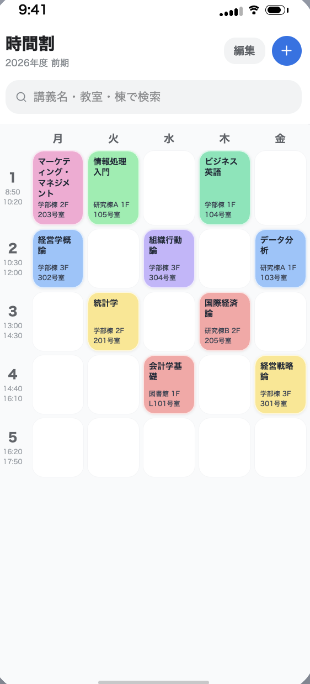
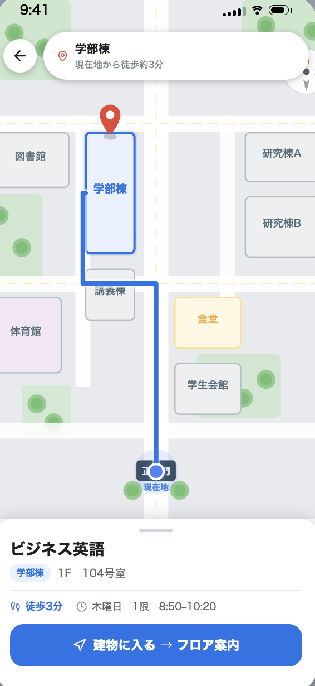
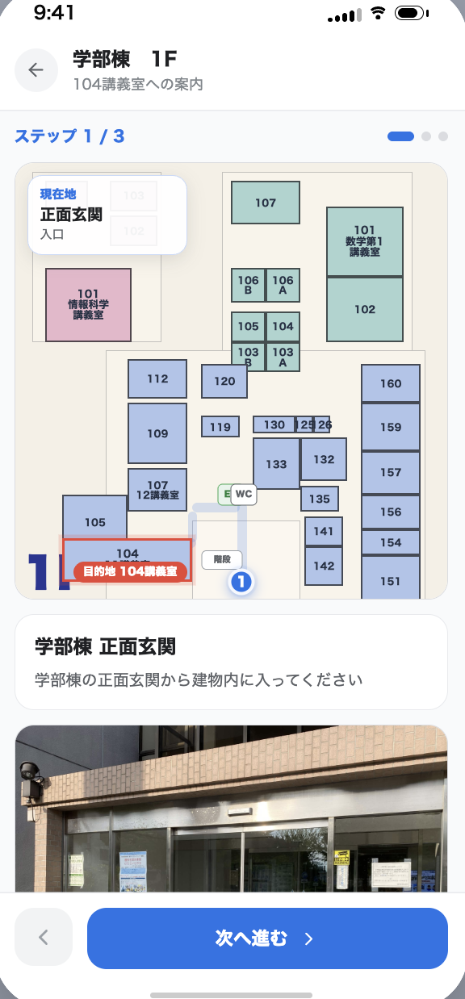
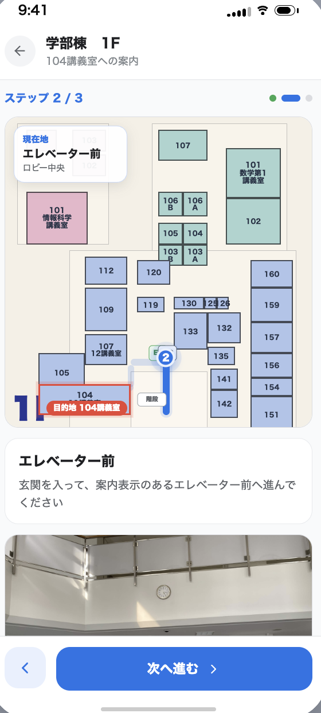
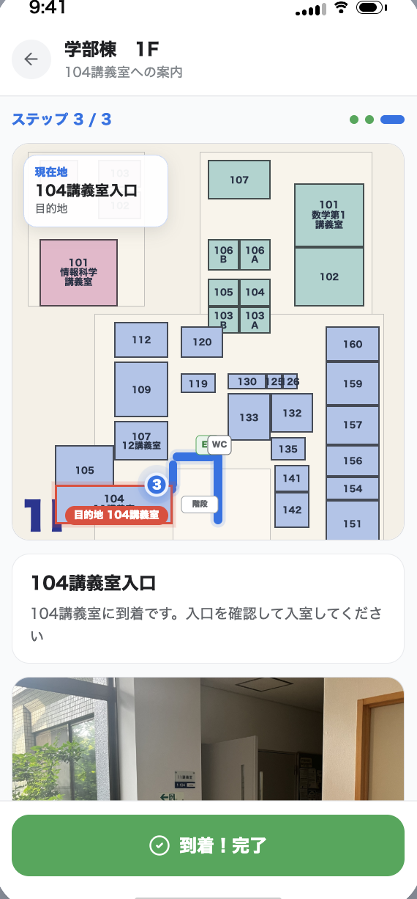

# 利用フローとシステム構成
### キャンパス授業ナビ

---

## 目的

- ユーザーがシステムを利用する流れと、それを実現する画面・データ・処理の構成についてまとめる
- 利用のきっかけから結果を得るまでの流れに沿って、画面遷移やシステム構成を整理する

---

## 利用のきっかけ

- 次の授業の教室や建物の場所を確認したい
- 時間割から目的の授業を探したい
- 建物までは着いたが、講義室がわからない

---

## 全体の流れ（きっかけ→結果）

時間割で探す(・追加する) → マップで建物へ向かう → フロアを進む → 講義室に到着

---

## ① 時間割画面：画面・データ・処理

<small>時間割画面：曜日・時限ごとに授業を一覧表示し、検索欄から探すこともできる</small>

| データ | 処理 | 出力 |
| --- | --- | --- |
| 授業情報（名前・曜日・時限・建物・階・教室番号） | 検索、時間割への追加、重複チェック | 授業一覧・追加後の時間割 |

---

## ② キャンパスマップ画面：画面・データ・処理

<small>キャンパスマップ画面：選んだ授業の建物までの道順と徒歩時間を表示する</small>

| データ | 処理 | 出力 |
| --- | --- | --- |
| 建物情報（位置・道順・徒歩時間） | 現在地から目的の建物までのルート計算 | 道順・徒歩時間・目的地表示 |

---

## ③ フロア案内画面：画面・データ・処理

|  |  |  |
| --- | --- | --- |
| ステップ1：正面玄関 <small>建物の入口を確認</small> | ステップ2：エレベーター前 <small>建物内で進む方向を確認</small> | ステップ3：104講義室入口 <small>目的地に到着</small> |

| データ | 処理 | 出力 |
| --- | --- | --- |
| フロア情報・目印写真（玄関/エレベーター前/講義室入口） | 「次へ進む」操作で案内段階を切替 | 現在地・目印写真・説明文 |

104講義室入口に到着し、「到着！完了」で結果を得る

---

## 結果として得られるもの

- 次に向かう授業を時間割からすぐに見つけられる
- 現在地から建物までのルート・徒歩時間を確認できる
- 建物内を写真と地図を見ながら迷わず進める
- 「到着！完了」で目的地への到着を確認できる